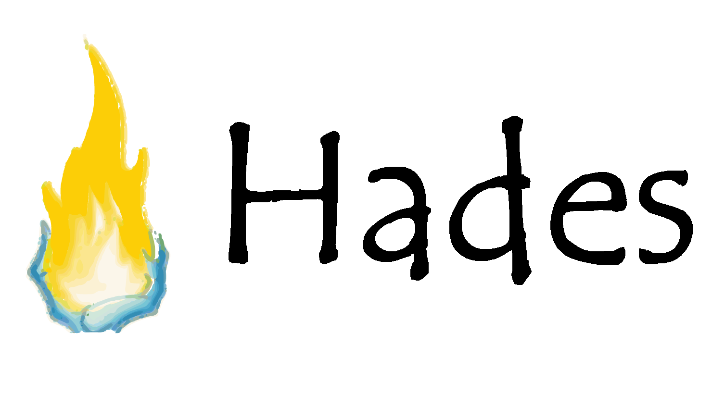

## Hades Programming Language

[](https://travis-ci.org/Azer0s/HadesLang)
[](https://github.com/Azer0s/HadesLang/blob/master/LICENSE)

## Welcome!

This is the official repository for the reference implementation of the Hades Programming Language (standard library & interpreter).

### Hello world
```js
with console from std:io
console->out("Hello world")
```

### Pipelines
```js
with list fixed from std:collections
with console from std:io

var fruits = list->of({"Apple", "Banana", "Mango", "Kiwi", "Avocado"})

fruits
|> map({x => x->toLower()}, ??)
|> filter({x => x->startsWith("a")}, ??)
|> forEach({x => console->out(x)}, ??)
```

### Function guards
```swift
with console fixed from std:io

func myFunction(int a) requires a < 10
    console->out("a is smaller than 10")
end

func myFunction(int a) requires a > 10
    console->out("a is greater than 10")
end

out(myFunction(5))   // a is smaller than 10
out(myFunction(17))  // a is greater than 10
```

### Fibonacci sequence
```js
with console from std:io

func fib(n)
    if((n is 0) or (n is 1))
        put n
    end
    
    put fib(n-1) + fib(n-2)
end

fib(10) |> console->out
```

## Getting Started

Learning Hades and writing your first programs.

### [Installing Hades](https://hadeslang.gitbook.io/doc/getting-started/installing-hades)

Instructions for downloading HadesLang and/or embedding it into your programs.

### [Basic Syntax](https://hadeslang.gitbook.io/doc/getting-started/basic-syntax)

Hades basics and quick introduction into the language.

### [Coding Conventions](https://hadeslang.gitbook.io/doc/getting-started/coding-conventions)

Current coding style for HadesLang.

## References

### [Language Spec](https://hadeslang.gitbook.io/doc/language-spec)

The official HadesLang specification.

### [Package Documentation](https://hadeslang.gitbook.io/doc/core-libraries/standard-library)

Documentation and definition of the Hades standard library.

### [Tool Documentation](https://hadeslang.gitbook.io/doc/other/tools)

Documentation for HadesLang tools.

### [Examples](https://hadeslang.gitbook.io/doc/other/examples)

Examples of Hades in use.
